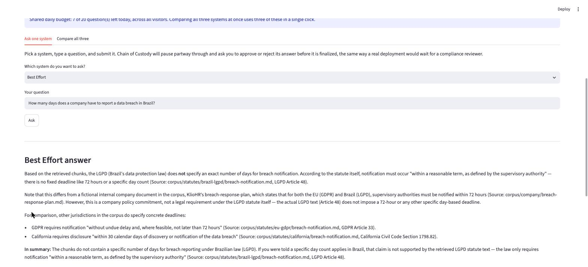
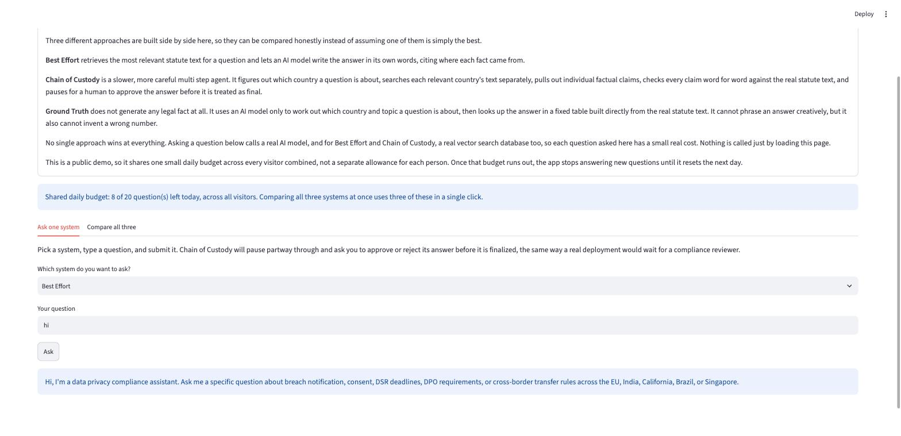

# Cross Jurisdiction Compliance Agent

**Live demo:** [cross-jurisdiction-compliance-agent.streamlit.app](https://cross-jurisdiction-compliance-agent.streamlit.app/)

Compliance teams that operate across multiple countries often need to
answer questions like "how many days do we have to report a data
breach," and the correct answer depends entirely on which country's
law applies, each with its own statute, its own wording, and its own
deadline. This project explores what it takes to build an AI system
that can answer cross jurisdiction data privacy questions accurately,
citing the exact statute section behind each answer, across five
jurisdictions: the European Union, India, California, Brazil, and
Singapore.

## Three approaches, compared head to head

Rather than building one system and assuming it works, this project
builds and evaluates three different approaches to the same problem,
using the same 90 question benchmark.

- **Best Effort** is a baseline retrieval and answer system. It searches
  the statute text for relevant passages and lets an AI model write
  the answer in its own words, citing where each fact came from.
- **Chain of Custody** is a more careful, multi step agent. It figures out
  which country a question is about, retrieves text separately for
  each one, pulls out individual factual claims, verifies every claim
  word for word against the real statute text, and pauses for a human
  to approve the answer before it counts as final.
- **Ground Truth** is a deterministic rule lookup. It uses an AI model
  only to classify which jurisdiction and topic a question is about,
  then returns a fixed answer built directly from the real statute
  text. It cannot generate a wrong number, because it never generates
  a number at all.

| System | Approach | Key tech | Tradeoff |
|---|---|---|---|
| Best Effort | Baseline retrieval augmented generation | Voyage embeddings, MongoDB Atlas vector search, Claude | Fast and simple, but citation accuracy depends on the model remembering to state it correctly |
| Chain of Custody | Verified agentic pipeline with human approval | LangGraph, MongoDB Atlas vector search, Claude, deterministic verification | Most reliable citations, but slower and more costly per question |
| Ground Truth | Deterministic rule lookup | Claude for classification only, a fixed lookup table | Cannot invent a wrong fact, but has no flexibility or judgment |

## Headline result

A deterministic lookup table wins decisively on questions that have a
small, fixed set of correct answers, whether that is one country's
exact deadline or several countries' deadlines compared side by side,
since there is no retrieval step to miss and no generation step to get
the citation wrong. The baseline retrieval system's advantage shows up
on the questions a fixed table cannot handle at all: correcting a
misleading or adversarial claim, and drafting an actual document
rather than just stating a fact. See [docs/RESULTS.md](docs/RESULTS.md)
for the full numbers.

## Running it

The easiest way to try this is the live demo above, or locally with
the same Streamlit interface:

    streamlit run app.py

Pick a system from the dropdown, type a question about a data breach,
consent, or retention rule in any of the five jurisdictions, and
submit it. Each answer comes back with the exact statute section it
was pulled from. Pick Chain of Custody specifically to see its extra
step: it pauses partway through and shows you the individual claims
it verified against the source text, then waits for you to approve
or reject the answer before treating it as final, the same way a
real compliance reviewer would. The "Compare all three" tab runs the
same question through all three systems at once, side by side.

The live demo is a public, shared instance, so it caps total usage at
a small number of questions per day across every visitor combined,
shown on the page. Running it locally with your own API keys has no
such cap. See [DEPLOY.md](DEPLOY.md) for how to build and run the
whole thing in a container instead.

The app also tracks basic product analytics (App Opened, Question
Submitted, Answer Displayed) to see where visitors drop off, and runs
a small free guard that filters out greetings and other obviously
off-topic input before it reaches a paid model call.

## Read more

- [concepts.md](concepts.md), how the three systems actually work
- [journey.md](journey.md), the full build story, mistakes included
- [docs/RESULTS.md](docs/RESULTS.md), the raw comparison data
