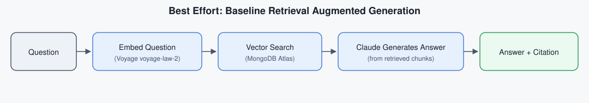
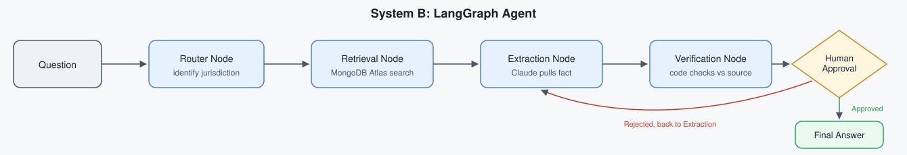
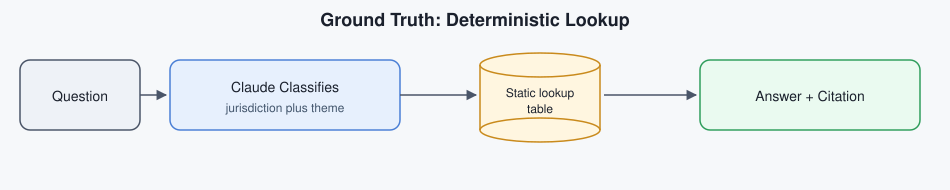

# Concepts
This document explains how the three systems work, at two levels of depth. For the story of how they were actually built, including what went wrong along the way, see [journey.md](./journey.md).
## Section 1: In plain terms
Imagine you need to know how many days a company has to report a data breach in Brazil. There are a few ways you could find out.

You could look it up yourself in a paper rulebook. If the rule you need is actually written down in the book, you will get the right answer every time, worded exactly the way the book words it. But the rulebook cannot explain anything it does not already contain, and it cannot help you at all if your question is not really about looking something up, it can only turn pages, never think.

You could ask a well read assistant instead. They have read a huge amount and can explain things in their own words, compare several countries at once, and write you a polished summary. Most of the time they get it right. But they are working from memory and impression, not from the book in front of them, so once in a while they will state something with total confidence that turns out to be slightly wrong, or borrow a detail from the wrong country by mistake.

Or you could ask that same assistant to show their work. Before they give you an answer, they have to point to the exact page and sentence their claim comes from, someone checks that the sentence they pointed to actually says what they claim it says, and only after that check passes does a supervisor sign off before the answer goes out the door. This takes longer and involves more steps, but a wrong claim gets caught before anyone sees it, not after.

This project builds all three of those approaches for real, as three separate systems, and tests them against the same set of questions to see which one is actually right, how often, and for what kind of question. The rulebook is Ground Truth. The well read assistant is Best Effort. The assistant who shows their work is Chain of Custody.
## Section 2: How it actually works
**Embeddings.** To let a computer search text by meaning instead of by matching exact words, every piece of statute text is converted into an embedding, a list of numbers that represents what that text means. Two passages about a similar idea end up with similar number lists, even if they do not share any of the same words. This project uses a legal domain tuned embedding model rather than a general purpose one, since legal language has its own vocabulary and structure that a model trained mostly on general web text handles less precisely.

**Vector search.** Those embeddings are stored in a vector database. When a question comes in, it gets turned into its own embedding, and the database finds which stored passages have the closest embeddings to the question, meaning the closest in meaning, not the closest in exact wording. This is what lets a question worded differently from the statute still find the right statute passage.

**The agent's structure (Chain of Custody).** Chain of Custody is built as a graph of steps, where each step does one job and passes its work to the next step:

1. A router step reads the question and decides which of the five supported jurisdictions are actually relevant to it.
  
2. A retrieval step runs a separate vector search for each relevant jurisdiction, so an answer about one country cannot accidentally pull in another country's text just because it happens to be similar.
  
3. An extraction step turns the retrieved text into a structured list of claims, where each claim is forced to include exactly which source file it came from and the exact quoted sentence that supports it, rather than letting the model just write a paragraph.
  
4. A verification step checks every one of those quotes against the real file on disk, word for word. Anything that does not match exactly is thrown out and never reaches the final answer.
  
5. A human approval step pauses the whole process and waits for an actual decision, approve or reject, before anything is treated as final. Nothing is shown as a finished answer without that step happening.
  

**The deterministic lookup (Ground Truth).** Ground Truth does not use vector search or free form generation at all for the actual answer. It has a fixed table of the real facts, copied directly from the statute text by hand ahead of time. The only job an AI model does here is read the question and decide which row (or rows, for a question spanning several countries) of that table applies. The model is never allowed to state the fact itself, only to point at which fact applies, which is why Ground Truth cannot invent a wrong number, it simply has no path to produce a number that was not already sitting in the table.
## Section 3: How each system works
This section shows the actual technical flow of each system, with the specific tools each step uses.
### Best Effort: baseline retrieval augmented generation
Best Effort is a standard retrieval augmented generation setup, often called RAG. The question is turned into an embedding, the closest matching law chunks are found through a vector search, and Claude writes the answer directly from those retrieved chunks. This is the simplest of the three systems, one embedding call and one generation call per question, with nothing double checking the result afterward.

### Chain of Custody: LangGraph agent
Chain of Custody is built with LangGraph, an agent framework. Instead of one single call to a model, the question moves through a defined sequence of steps, a router, a retrieval step, an extraction step, a verification step, and a human approval step. LangGraph is a workflow orchestration framework, not a knowledge graph, it manages the order these steps run in and lets the process pause partway through and wait for a real human decision before continuing. This extra structure exists specifically to add checkable steps and a real human checkpoint before anything is ever returned as final.

### Ground Truth: deterministic lookup
Ground Truth does not use vector search or an agent framework at all. Claude is only used to classify which jurisdiction and theme a question is about. Once that classification is made, a plain Python dictionary lookup returns the pre written fact and citation for that exact row. The model never generates the fact itself, only points at which row applies, which is what avoids any chance of the model inventing the fact on its own.

