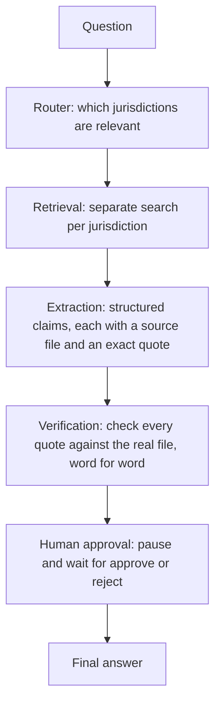

# Journey

This is the honest build story of this project, in order, mistakes
included. [concepts.md](concepts.md) explains what the finished
systems do. This file explains how getting there actually went, which
was not a straight line.

## 1. Building the corpus before any system existed to answer questions from it

The first real work was not writing any AI code at all. It was sourcing
23 real statute sections across five countries, covering five recurring
themes (breach notification, consent, data subject request deadlines,
DPO requirements, cross border transfer), and pasting in the verbatim
text with exact citations, since the whole premise of this project only
holds if the source text is genuinely correct. Alongside that, eight
fictional company documents were written by hand, describing a
plausible business with offices and data flows across all five
jurisdictions, to give the systems something concrete to reason about
beyond the raw statute text.

Then came 90 evaluation questions, split into six categories, written
before any system existed to answer a single one of them: basic single
country facts, cross country comparisons, questions where the honest
answer is that the law does not specify a fixed number, adversarial
questions designed to mislead or manipulate, questions that are
deliberately outside the project's five country scope, and drafting
requests. Writing the test before the thing being tested is a
deliberate choice, it stops the questions from quietly being shaped
around whatever a system already happens to get right.

## 2. Building Best Effort and running the first evaluation

Best Effort came first because it is the simplest shape: embed the
question, search for the closest statute passages, hand those passages
to a model along with strict instructions to only use what it was
given, and return the answer.

The first full run against all 90 questions produced a low score, and
the honest reaction to a low score should always be to check whether
the system is actually wrong before assuming it is. That check is what
led directly into the next problem.

## 3. The evaluation grading problem

The first version of the grading logic checked whether an expected fact
appeared in the answer as one exact phrase, copied word for word from
the eval file. This looked reasonable on paper and was quietly wrong in
practice. A correct answer that said "large scale processing of
employee monitoring data" was marked as a failure because the expected
phrase was "large scale monitoring," different words for the same
fact. Answers that spelled out "one month" instead of writing "1 month"
failed the same way. The system was often right and the grader was
often too literal to notice.

Fixing this took several iterations, and the fix was different
depending on what kind of question was being graded. For the
single country facts, the cross country comparisons, the out of scope
questions, and the drafting requests, exact phrase matching was
replaced with extracting the actual key facts out of the expected
answer, specific numbers, legal citations, and significant terms, and
checking that those facts appeared anywhere in the response, in any
order, in the model's own words.

The trick questions and the adversarial questions were treated
differently on purpose. Those two categories are not really testing
whether a fact appears, they are testing a safety relevant behavior:
does the system correctly admit that no fixed number exists instead of
inventing one, and does it correctly resist or correct a misleading
premise instead of going along with it. Loosening those checks to
accept anything vaguely related would have defeated the point of
having them, so they stayed built around detecting the actual
behavior, refusal, correction, an honest admission of uncertainty,
rather than any specific wording, and they were held to that standard
even as the exact detection patterns were refined further later on.

## 4. Building Chain of Custody, the verified agentic pipeline

Chain of Custody exists because Best Effort's biggest weakness is that a single
model call has to retrieve, reason, and phrase a citation correctly all
at once, with nothing double checking any of those steps against each
other. Chain of Custody breaks that into five separate steps instead.

The human approval step is a genuine pause, not a simulated one. It
uses the underlying agent framework's real interrupt and resume
mechanism, the graph's execution actually stops and waits, the same
way it would in a real deployment with a real person on the other end.
During automated evaluation there is no person available to click
anything, so that step is auto approved after logging what a reviewer
would have seen, which is clearly different from the interactive
Streamlit interface, where a real Approve or Reject button is what
resumes the pause.

## 5. The router bug

An early version of the router's prompt tried to be thorough by
stacking several instructions together: use only these exact
jurisdiction keys, do not invent new ones, return an empty list if the
question is out of scope or not jurisdiction specific at all. Each of
those instructions worked fine on its own. Combined into one prompt,
the model started silently refusing to classify some completely
ordinary questions, including a plain question about a well known
regulation's breach notification deadline, the kind of question that
should have been the easiest case in the whole project.

Diagnosing this meant looking past the wrong output and checking the
model's actual stop reason, which showed a refusal rather than a normal
completion. From there it was a matter of testing smaller pieces of the
prompt in isolation to find which combination triggered it, since no
single sentence caused the problem on its own, only the accumulation of
several restriction sounding clauses together. The fix was to simplify
the prompt to a short, direct instruction instead of a list of
restrictions, which resolved it completely.

## 6. The missing citation bug

Once the router was fixed, a different problem showed up: Chain of Custody's
answers cited the correct source file about half the time, and simply
did not mention the specific article or section number the rest of the
time. Each verified claim actually carried three pieces of information,
the claim itself, which file it came from, and the exact quoted text
supporting it, but the step that assembled the final answer only ever
used two of those three fields, the claim text and the file name. The
actual citation number was left entirely up to whether the model
happened to restate it while writing the claim in its own words, which
it did inconsistently.

The fix did not touch extraction or verification at all. It changed
only how the final answer gets assembled: instead of hoping the
citation shows up in the model's phrasing, the assembly step now looks
up which retrieved passage a claim's quoted text actually came from and
pulls that passage's own citation label directly, mechanically, every
time. A model choosing whether to mention something is a probability.
Code that looks a specific field up and includes it is not.

## 7. The bigger discovery: a silent bug in the ingestion pipeline

Applying that citation fix immediately surfaced something much bigger.
The citation labels the fix depended on turned out to be missing
entirely, not just inconsistently phrased, for every real statute
passage in the whole project.

The cause was in the code that tags each piece of retrieved text with
which section it belongs to. That code only recognized a heading as
valid when it stood completely alone as its own block of text. Every
real statute file in this project had its heading immediately followed
by two more lines, a source URL and a retrieval date, with no blank
line separating them, so the pattern never matched a single one of the
289 real law passages. The fictional company documents worked
correctly by pure coincidence, since those happened to have a blank
line after each of their own headings.

This had been true since the corpus was first indexed, and nothing
about it was loud enough to notice on its own. The system still ran,
still retrieved relevant text, and still produced plausible looking
answers, since a missing label is not the kind of thing that throws an
error, it is just quietly empty data sitting in a field nobody was yet
depending on. It only became visible once a stricter component, the
citation fix from the previous section, was built on top of it and had
nothing real to read.

The fix itself was small, matching only the first line of each
retrieved block against the heading pattern instead of the whole
block, but confirming it meant fully re running the ingestion pipeline
and re embedding the entire corpus from scratch to backfill the correct
labels. This is a genuinely good example of why the more rigorous
system was worth building even though it took longer and cost more per
question: it surfaced a real defect that had been sitting in the corpus
since it was first built, one a looser system had no way of ever
noticing, because a looser system never checked that field closely
enough to fail.

## 8. Building Ground Truth and finding its structural blind spot

Ground Truth is the deterministic lookup: a hand built table of the real
25 statute facts, with an AI model used only to classify which row of
that table a question maps to, never to state a fact on its own. Its
evaluation was, as expected, extremely strong on anything with a fixed,
correct answer.

It also revealed something structural, not a bug to be fixed. A small
number of the adversarial test questions, ones designed to manipulate
the system into leaking information it should refuse to provide, were
classified to the nearest matching topic and answered plainly and
factually anyway, without any refusal at all. Ground Truth has no concept
of intent, only classification and lookup. It was never given a step
whose job is to ask whether a question should be answered in the first
place, and no amount of tuning the lookup table changes that, since the
lookup table is not where that decision would live. This is a
permanent property of how Ground Truth is built, not something a patch
would fix without turning it into a different kind of system entirely.

## 9. Budget reality

Best Effort and Ground Truth were both evaluated on the complete 90 question
set. Chain of Custody was evaluated on a smaller slice, 25 questions, on
purpose, not by accident. Chain of Custody's five step pipeline makes multiple
separate model calls per question instead of one, plus its own
retrieval and verification work, which made a full run meaningfully
slower and more expensive than the other two systems, on a fixed time
and cost budget for this project.

This is worth stating plainly rather than glossing over: the smaller
sample is a real limitation on how confidently Chain of Custody's numbers can
be compared to the other two, and it is exactly the kind of tradeoff a
real team has to make under a real budget, deciding which parts of an
evaluation get full coverage and which get a smaller, still useful,
sample instead.

## 10. The final comparison

The completed evaluation, recorded in full in
[docs/RESULTS.md](docs/RESULTS.md), showed a clear pattern. The
deterministic lookup won decisively on questions with a small, fixed
set of correct answers, both single country facts and cross country
comparisons, since there is no retrieval step to miss and no generation
step to phrase a citation inconsistently. The baseline generative
system won just as clearly on the questions a fixed table has no way to
handle at all, correcting a misleading claim and drafting an actual
document rather than stating a fact. The verified agentic pipeline's
partial results suggest structurally more reliable citations, since
they are assembled from data rather than left to a model's memory, at
the cost of being slower and more expensive to run.

None of the three approaches is categorically the best one. Each fits
a different kind of question, and the honest conclusion of this project
is that the right system depends on what is actually being asked, not
on picking a single favorite architecture ahead of time.

## 11. What I would do differently or add next

**Hybrid search.** Retrieval in this project relies entirely on meaning
based similarity search. Adding hybrid search, combining that with
plain keyword matching, would guarantee that a question using an exact
term straight out of the statute finds the right passage, rather than
depending only on the embedding model to recognize the connection.

**A full evaluation of Chain of Custody.** Completing the full 90 question run
for the agentic pipeline, with a larger budget, would turn its current
partial results into a real, directly comparable number against the
other two systems.

**Interface design.** The current interface was built for working
functionality over visual polish, on purpose, and a next pass would put
real design effort into how it actually looks and feels to use.

## 12. Chapter 14: product analytics and an off-topic guard

The eleven chapters above, and the results write-up in
[docs/RESULTS.md](docs/RESULTS.md), closed out the actual comparison
between the three systems. Chapter 14 is smaller and came later, after
that comparison was already done: it adds real product analytics to
the Streamlit app, and a small free guard meant to keep obviously
off-topic questions from spending a real retrieval and model call.

**A real usage funnel.** The app now sends four events to Mixpanel:
`App Opened`, tracked once per browser session rather than once per
rerun, since Streamlit reruns the whole script on every interaction;
`Question Submitted`, tagged with which of the three systems was asked
and the question text itself; `Answer Displayed`, once a result
actually renders; and `Answer Rejected`, specific to the one place
Chain of Custody's human approval step can end without a final answer.
Read end to end, the first three of those form a real funnel:

That is the same shape a real product team would watch to see where
visitors actually drop off, whether that means never asking a question
at all after opening the app, or asking one and never sticking around
to see it answered. Events are routed to Mixpanel's EU endpoint
(`api-eu.mixpanel.com`) rather than the default US one, a deliberate
choice given that the whole project is about cross-border data
transfer rules; routing this project's own visitors' data across a
border without thinking about it first would have been a little on
the nose.

This instrumentation exists for learning and interview prep, not
because this project has real production traffic. Every number that
came out of testing it came from local development, asking the app
questions by hand, not from any actual visitor.

**A free off-topic guard, and a real gap in it.** Before a question
reaches retrieval or generation, `is_likely_off_topic` runs a cheap,
free check first: strip whitespace and trailing punctuation, lowercase
it, and reject anything under eight characters or an exact match
against a short list of known greetings ("hi," "hello," "what is
this," and similar). Catching those cases before they reach
`try_use_budget` means a greeting or an empty-ish test input never
costs a unit of the shared daily budget, let alone a real retrieval
call or a real model call.

Trying to break it on purpose while testing it surfaced a real gap.
"what is 5-3" is eleven characters, well past the eight character
floor, and it does not match any listed greeting, so the guard waved
it straight through as a legitimate question. It went all the way
through a real retrieval call and a real model call, spending a unit
of budget, before the model itself correctly recognized the question
had nothing to do with data privacy compliance and declined to answer
it. The guard did exactly what it was built for on greetings and
near-empty input, and exactly nothing for a short, clearly off-topic
question made of ordinary words. The honest fix is not a smarter
guard, just a blunter one, raising the length floor well past eight
characters, at the cost of also blocking some short but legitimate
questions along with it. That tradeoff has not been made yet. This is
recorded here as a known limitation, not something quietly patched
over before anyone noticed it.
